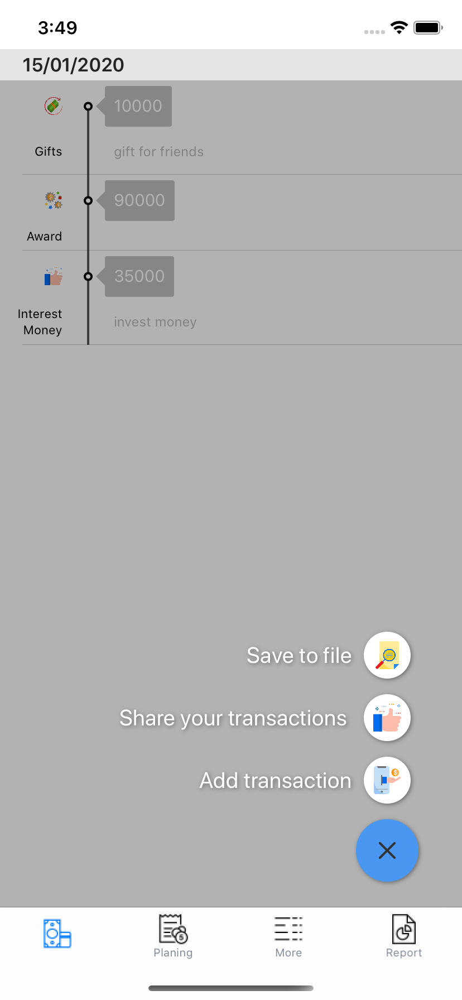

# MyMoney

This a first project when learn iOS developement.

# Requirements

- XCode 11+
- Swift >=4
- CocoaPod

# Library

Timeline Table View
- https://github.com/kf99916/TimelineTableViewCell

Float Action button
- https://github.com/kciter/Floaty

Pie Chart
- https://github.com/lludo/SwiftSunburstDiagram

# Features

> Planing fiancial

> Setting menu

